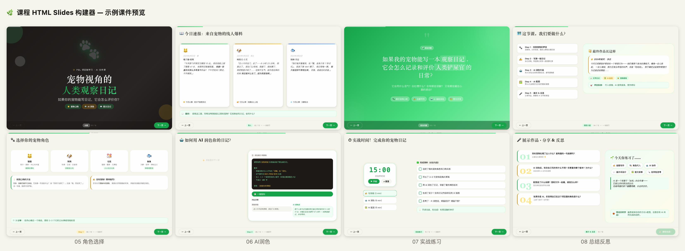

# Course HTML Slides Builder

> **An AI Skill that turns course outlines into multi-page HTML slide decks**

[](LICENSE)
[]()
[](README.zh.md)

**🌐 Language / 语言：** [English](README.md) · [中文](README.zh.md)

---

## 🌟 What is this?

An AI Skill for **Claude / Antigravity** that transforms course outlines into professional HTML slides — no design skills needed.

**Three-phase workflow:**

```
Course Outline  →  [Phase 1] Style Design  →  [Phase 2] Markdown Spec  →  [Phase 3] HTML Generation
```

Each slide is an independent HTML file linked by a shared bottom navigation bar. Built for classroom projection.

---

## ✨ Features

- 🎨 **5 preset style themes** — Warm Education, Cool Tech, Fresh Nature, Dark Geek, Minimal Elegant
- 📝 **8 page types** — Cover, Section Title, Content, Interactive Demo, Task Guide, Practice, Summary, QR Code
- 🤖 **Built-in interactions** — Chat bubble typewriter, click-to-reveal, flip cards, countdown timer
- ⌨️ **Keyboard / touch navigation** — Arrow keys, spacebar, swipe gestures
- 📱 **Responsive design** — Adapts to projectors and different screen sizes

---

## 📁 Skill Structure

```
course-html-slides/
├── SKILL.md                     # Main instruction file (read by AI)
├── chat-animation-pattern.md    # Chat animation reference
├── click-to-reveal-pattern.md   # Progressive disclosure reference
└── references/
    ├── style-presets.md         # 5 complete style presets
    └── design-spec-format.md    # Markdown design spec format
```

---

## 🚀 How to Use

### Prerequisites

[Antigravity](https://antigravity.ai) or any Claude client that supports the Skill system.

### Installation

**Global install (recommended):**
```bash
cd ~/.agents/skills
git clone https://github.com/HelenSong/course-html-slides-skill.git course-html-slides
```

**Project-level install:**
```bash
cd your-project/.agents/skills
git clone https://github.com/HelenSong/course-html-slides-skill.git course-html-slides
```

### How to trigger

After installing, just say:

> "Help me turn this course outline into HTML slides"

> "I want slides for a Python intro course with a tech vibe"

> "Generate HTML files from this Markdown design spec"

---

## 📖 Workflow

### Phase 1 — Style Design

The Skill asks about your style preferences or lets you pick a preset:

| Preset | Best For | Primary Color |
|---|---|---|
| 🍊 Warm Education | K12, parent-child education | Orange + Blue |
| 🧊 Cool Tech | STEM, coding, corporate training | Indigo + Cyan |
| 🌿 Fresh Nature | Biology, crafts, outdoor education | Forest Green + Amber |
| 🌙 Dark Geek | Tech talks, hackathons | Dark + Neon |
| 🎨 Minimal Elegant | Humanities, general education | Black-White + Accent |

Output: `style-guide.md`

### Phase 2 — Markdown Design Spec

The Skill converts your outline into a structured per-page design document covering: page type, content, layout, and interaction.

Output: `design-spec.md`

### Phase 3 — HTML Generation

Batch-generates HTML files alongside a shared CSS/JS design system:

```
slides/
├── styles/
│   ├── theme.css       # Theme (colors, typography, border-radius)
│   ├── animations.css  # Animation system
│   └── components.css  # Reusable components
├── js/
│   └── slide-nav.js    # Navigation controller
├── p01-cover.html
├── p02-*.html
└── ...
```

---

## 🎮 Example: Pet Diary Course

> **"Human Observation Diary from a Pet's Perspective"** — PBL course, 12 slides, Fresh Nature style



| Page | Type | Highlights |
|---|---|---|
| 01 | Cover | Dark bg + floating paw + gradient title |
| 02 | Hook | Three-column pet diary cards |
| 03 | Driving Question | Full-screen green gradient + keyword tags |
| 04 | Project Intro | PBL 5-step + outcome preview (two-column) |
| 05 | Role Selection | Clickable pet character cards |
| 06 | AI Writing Guide | Click-to-Reveal steps + one-click copy prompt |
| 07 | Practice | 15-min timer + phase tracker + checklist |
| 08 | Reflection | Discussion questions + skill wall |

---

## 🛠 Technical Specs

- **Pure HTML/CSS/JS** — No framework dependencies, works offline
- **CSS variable-driven** — Switch themes by editing variables in `theme.css`
- **All sizes via `clamp()`** — Responsive across different resolutions
- **No scroll per slide** — Content strictly stays within `100vh`

---

## 📄 License

MIT License — Free to use, modify, and share

---

## 🙏 Acknowledgements

- Created by [HelenSong](https://github.com/HelenSong)
- Built with [Antigravity](https://antigravity.ai) Skill system
- Methodology: [skill-creator](https://github.com/anthropics/skills)
